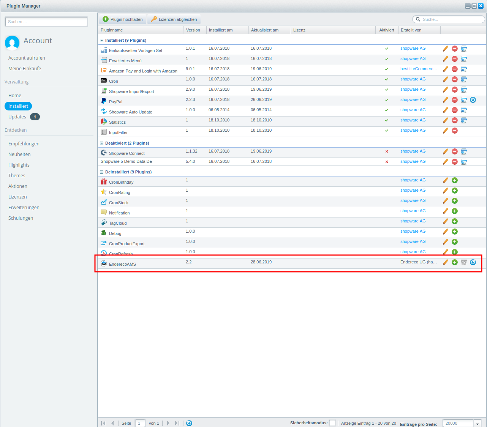
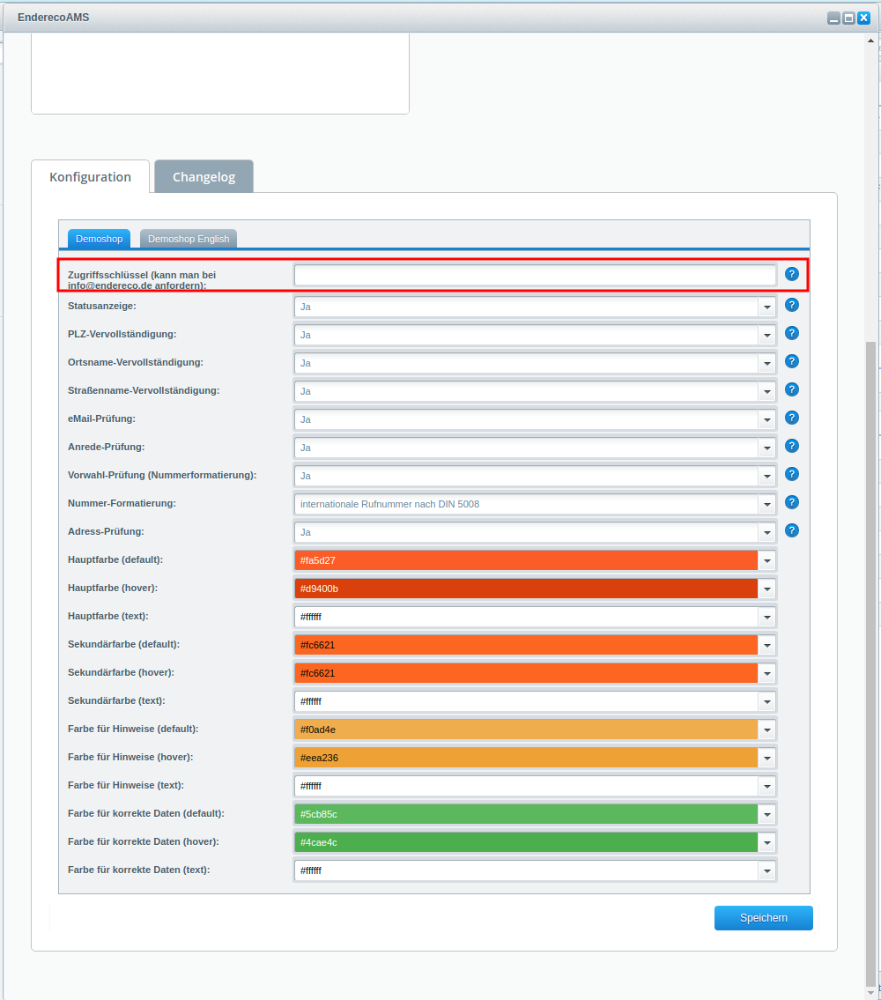
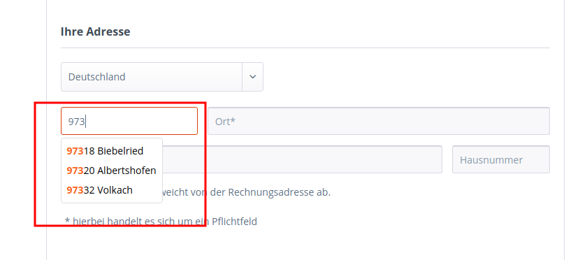
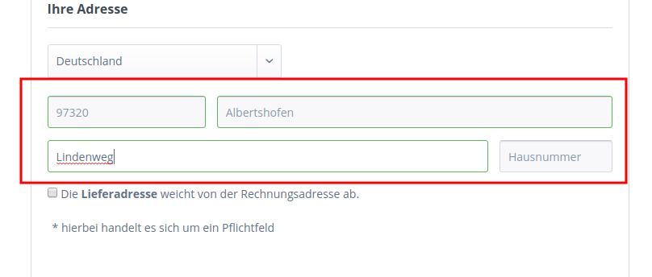
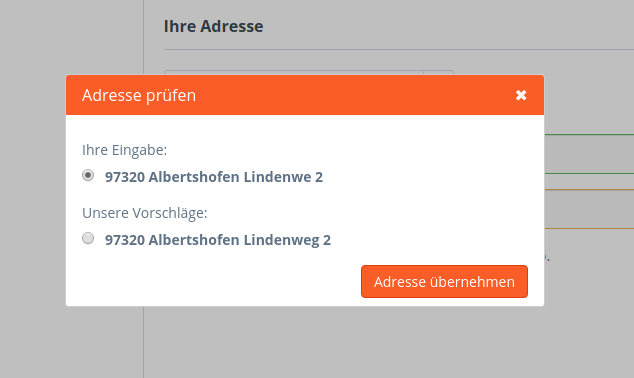

# Endereco Shopware Modul

## Installation

Dateien ins Verzeichnis %ROOT%/custom/plugins/EnderecoAMS kopieren. Falls der Verzeichnis nicht existiert -- einfach anlegen.

Der Plugin soll nun im Plugin-Manager erscheinen.

Danach installieren und aktivieren. Es kommt automatisch eine Aufforderung das Theme neuzukompilieren. Falls nicht: Theme manuell neu kompilieren.

## API Key

Nachdem der Plugin installiert und aktiviert ist muss der API Key in Plugin-Konfiguration hinterlegt werden.

Den API Key kann Rober Rieser (robert@endereco.de) oder Lena Schmitt (lena@endereco.de) erteilen.

Entweder direkt anfragen oder das Formular ausfüllen: [API Key anfordern](https://mobilemojo.typeform.com/to/CFQdEw)

## Funktionsbeschreibung

Sobald der Plugin aktiv ist und ein valides API Key eingetragen ist, kann der Shop folgendes:

### Eingabehilfe

Der Plugin unterstützt und beschleunigt die Eingabe der Adressdaten.

### Eingabevalidierung

Die Felder werden zusätzlich validiert.

### Addressprüfung und -ausbesserung

Bei fehlerhafter oder unbekannter Adresse wird eine Bestätigung angefordert und mögliche richtige Adressen vorgeschlagen. 
